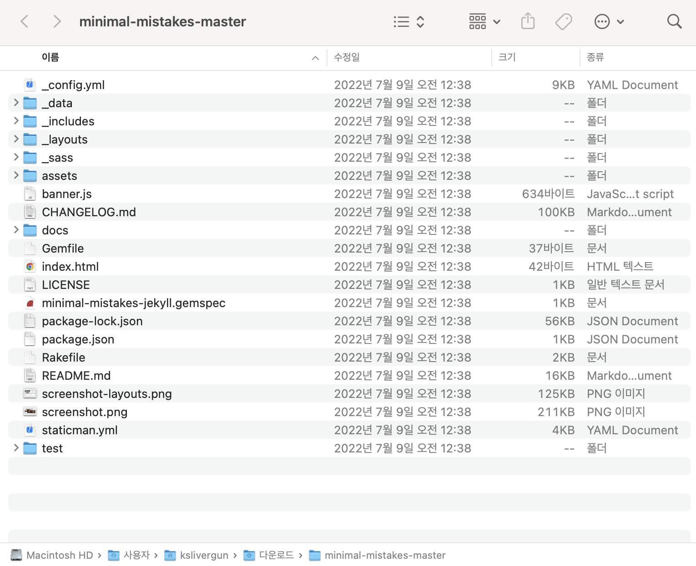

드디어 나도 깃허브 블로그가 생겼다고 기뻐하긴 이르다. 우리는 테마를 적용해야한다. 이제 시작이다...
<br/><br/><br/><br/>

# 1. 테마 선택
지킬에 적용할 수 있는 테마는 다양하다. 아래 링크에서 테마들을 찾아볼 수 있다.
https://jekyllthemes.io/free

테마를 고를 때는 몇가지 기준을 두고 고르면 좋다.
1. 가독성이 좋은지
2. 적용하기 쉽도록 readme 설명이 잘 되어 있는지.

나 같은 경우는 아직 깃허브 블로그의 파일 구조가 익숙하지 않아서, 쉽고 사용자가 많았던 >minimal mistakes< 를 선택했다. 
<a href="https://jekyll-themes.com/category/minimal-mistakes">minimal-mistakes 테마로 만든 다른 블로그</a>
<br/><br/>

# 2. 테마 적용
가장 중요한 과정이다. 여기서 에러가 많이 났다. 테마마다 적용 방법이 다르니 잘 찾아봐야 한다. (그래서 readme 파일이 잘 써진 테마를 써야한다.)
## 2-1. 테마 직접 다운로드
<a href="https://github.com/mmistakes/minimal-mistakes">minimal-mistakes 테마 github 주소</a>
테마의 깃허브 주소에서 파일을 다운로드한다.

다운로드를 마치면 압축을 해제한다. 그럼 다음과 같이 파일이 들어있다.


## 2-2. 불필요한 파일 제거
다음 파일들은 테마 제작자가 미리보기를 위해 깃허브에 같이 올린 것이기 때문에 그대로 적용할 시 내 블로그를 더럽힐 수 있다. 어차피 지울거 미리 제거해두면 좋다. 
- .editorconfig
- .gitattributes
- .github
- /docs
- /test
- CHANGELOG.md
- minimal-mistakes-jekyll.gemspec
- README.md
- screenshot-layouts.png
- screenshot.png

## 2-3. 필요한 파일 생성
- **_posts** 폴더가 없다면 만들어 두는 것이 좋다. markdown 파일로 블로그에 포스팅할 수 있는 폴더이다.
- 나 같은 경우는 기존 assets 폴더에 이미지 업로드가 안되어서 따로 **img** 폴더를 만들어주었다.
- **.gitignore** 파일을 편집한다. 깃허브에 업로드할 때 생기는 불필요한 파일을 무시할 수 있다. mac의 경우 .DS_Store가 자주 생기기 때문에 무조건 추가한다. 그 외 적용할 수 있는 gitignore 내용은 아래를 참고하시라.
<a href = "https://gist.github.com/bradonomics/cf5984b6799da7fdfafd">.gitignore 참고</a>

## 2-4. 내 깃허브 블로그 폴더에 붙여넣기
이제 정리한 파일들을 그대로 전부 복사해서 [깃허브 사용자명].github.io 폴더에 넣어주면 된다. 폴더에 들어간 파일은 다음과 같다.


## 2-5. 로컬에서 확인하기
다음 명령어를 통해 로컬 주소로 할당된 서버에 접속할 수 있다. (실행하기 전에 반드시 ruby가 설치되어 있어야 한다.)
```sh
$ bundle install
$ bundle exec jekyll serve
```
실행하면 다음과 같이 address가 뜨는데 이 주소로 가면 내 블로그 상태를 저장할 때마다 바뀌는 걸 확인할 수 있다. 

이때 중간중간 보이는 conflict가 있다면 수정해주면 된다.

## 2-6. 리모트 저장소에 push
```sh
$ cd [깃허브 사용자명].github.io
```
```sh
$ git add -A
```
```sh
$ git commit -m "minimal-mistakes 테마 적용"
```
```sh
$ git push origin main
```
이제 깃허브의 Deployments 에서 내 블로그를 확인할 수 있다. 주소는 보통 이렇다.
https://[깃허브 사용자명].github.io/

<br/><br/>

# 3. 테마 커스터마이징
테마를 올바르게 적용하기 위해서 몇가지 편집이 필요하다.

## 3-1. Gemfile
gemfile에 다음 코드 몇 줄을 추가한다.
```
source "https://rubygems.org"

# minimal-mistakes-jekyll
# gem "jekyll", "~> 3.5"
gem "minimal-mistakes-jekyll"

gem "ffi", "~> 1.16"
```

## 3-2. _config.yml
```
# Site Settings
- locale                   : "ko-KR"
...
- url                      : "https://github.com/[깃허브 사용자명].github.io" 
# the base hostname & protocol for your site e.g. "https://mmistakes.github.io"
...
- repository               : https://[깃허브 사용자명].github.io/ 
# GitHub username/repo-name e.g. "mmistakes/minimal-mistakes"
```

## 3-3. 여백 조정
/_sass/minimal-mistakes/_variables.scss 파일에서
```
$right-sidebar-width-narrow: 200px !default;  // default 200px
$right-sidebar-width: 250px !default;         // default 300px
$right-sidebar-width-wide: 250px !default;    // default 400px
```
이 외 본인의 취향에 맞게 조절할 수 있다.


<br/>
> 참고 블로그\
https://junhobaik.github.io/jekyll-apply-theme/
https://mmistakes.github.io/minimal-mistakes/about/
https://djccnt15.github.io/webdev/blog_customizing/#6-posts-by-month-%EC%9E%91%EC%84%B1
