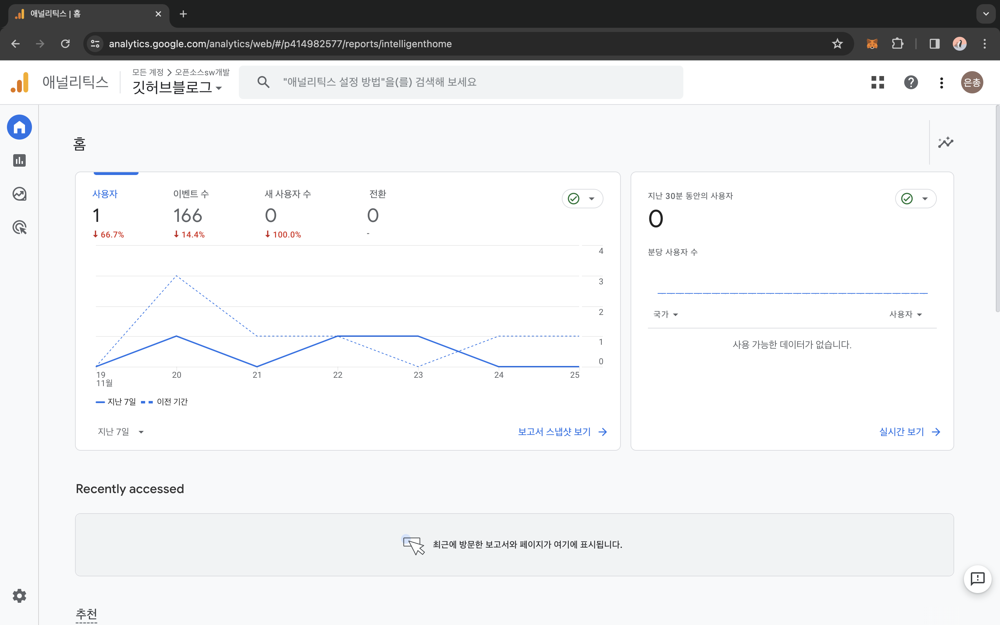
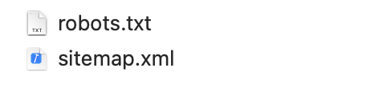
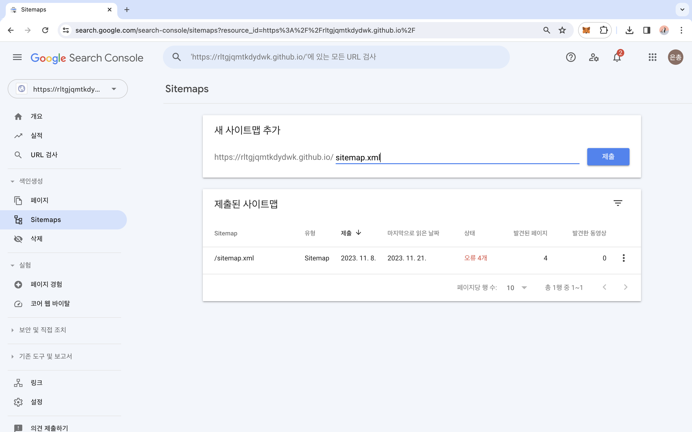
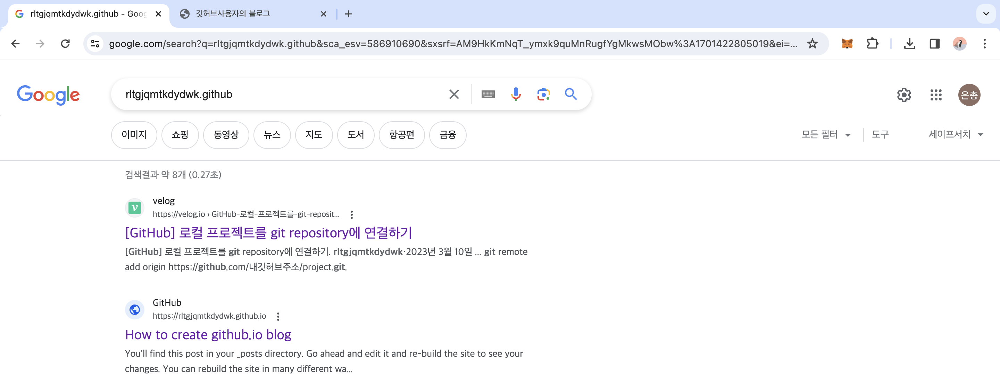
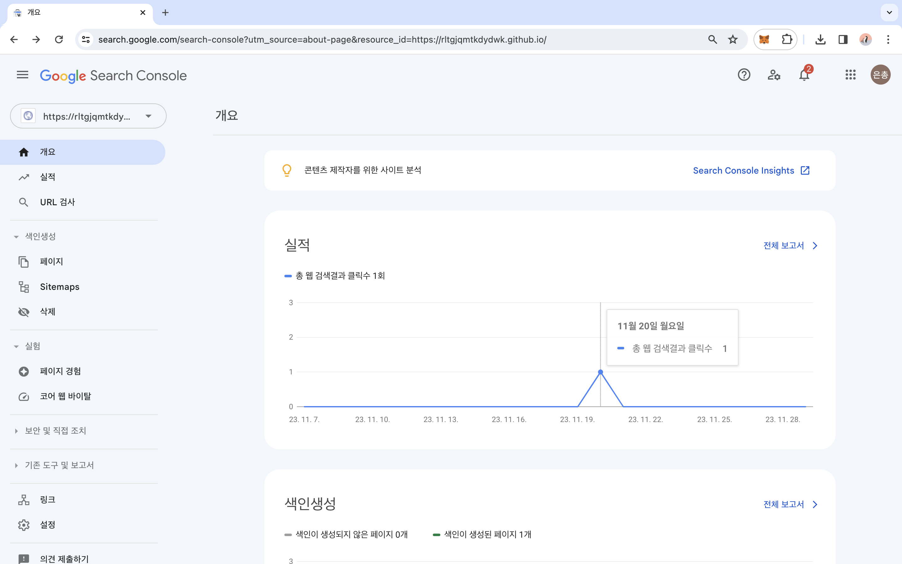

# 방문자 통계 만들기 : 구글 애널리틱스(Google Analytics) 
## 1. 구글 애널리틱스 사이트에 로그인
<a href="https://marketingplatform.google.com/about/analytics/">Analytics Tools & Solutions for Your Business <br/>^google analytics 사이트</a>
<br/>
자신의 구글 계정으로 로그인한 후, 깃허브 블로그 주소를 써넣는다. (기업의 규모 같은 비즈니스적인 내용은 대충 적는다. 어차피 블로그라 상관없을 듯 싶다)
<br/><br/>

##2. _config.yml 수정
**_config.yml** 에서 # Analytics 부분의 provider:와 tracking_id을 수정한다. 
```yml
# Analytics
analytics:
  provider               : "google-gtag" # false (default), "google", "google-universal", "google-gtag", "custom"
  google:
    tracking_id          : G-9E4ENXQZVY     # 자신이 할당받은 트레킹 아이디로 쓸 것
    anonymize_ip         : # true, false (default)
```
<br/><br/>

## 3. google tag 코드 추가
**_includes/head.html** 의 중간에 다음과 같이 자신이 할당받은 gtag 스크립트 코드를 추가해준다.
```html
<!-- Google tag (gtag.js) -->
<script async src="https://www.googletagmanager.com/gtag/js?id=G-9E4ENXQZVY"></script>
<script>
  window.dataLayer = window.dataLayer || [];
  function gtag(){dataLayer.push(arguments);}
  gtag('js', new Date());

  gtag('config', 'G-9E4ENXQZVY');
</script>
```
<br/><br/>

## 4. github에 push
깃허브에 push 해주고 조금만 기다리면 애널리틱스 홈페이지에서 내 블로그의 방문자 통계를 볼 수 있다.



<br/><br/><br/><br/>

# 크롬에 검색되기 : 구글 서치콘솔(google-search-console) & <br/> 방문 기록 보기 : 사이트맵(sitemap)

## 1. 아래 링크에 들어가서 계정을 만든다.
[Google Search Console](https://search.google.com/search-console/about)<br/>
그냥 절차대로 잘 따라가면 된다. 아마 기업이냐 뭐냐 물어볼 건데, 다 상관없고 만들기만 해라.
<br/><br/>

## 2. 교수님이 주신 아래 두개의 파일을 내 깃허브 블로그 repo에 push 한다.

<br/><br/>

## 3. 다음으로 사이트맵에 xml 파일 이름을 입력한다.
내 블로그 주소 옆에 sitemap.xml 파일 이름을 써서 제출해야 google이 내 블로그를 찾을 수 있다. 

<br/><br/>

## 4. 짜잔
다음과 같이 구글에 내 블로그가 검색된다. 두번째에 how to create github blog가 내 깃허브 블로그이다. (~~tmi : 첫번째 velog도 내 블로그이긴 하다~~)<br/>
근데 포스팅 이름이 저따구인 이유는 처음 만들 때 포스트 이름이 그대로 남기 때문이다.
> " 첫 단추를 잘 꿰맸어야지... "


<br/>

그리고 서치 콘솔에 방문자 기록도 볼 수 있다. 

나 한명이 보는 블로그! 우와~

<br/><br/><br/><br/>